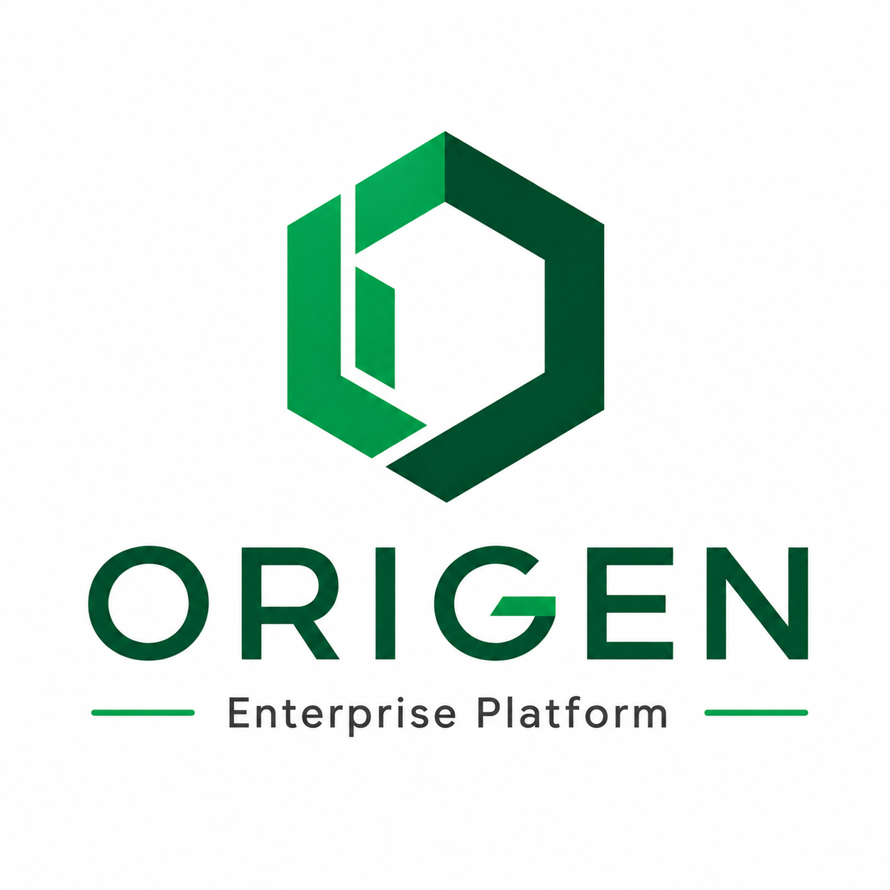
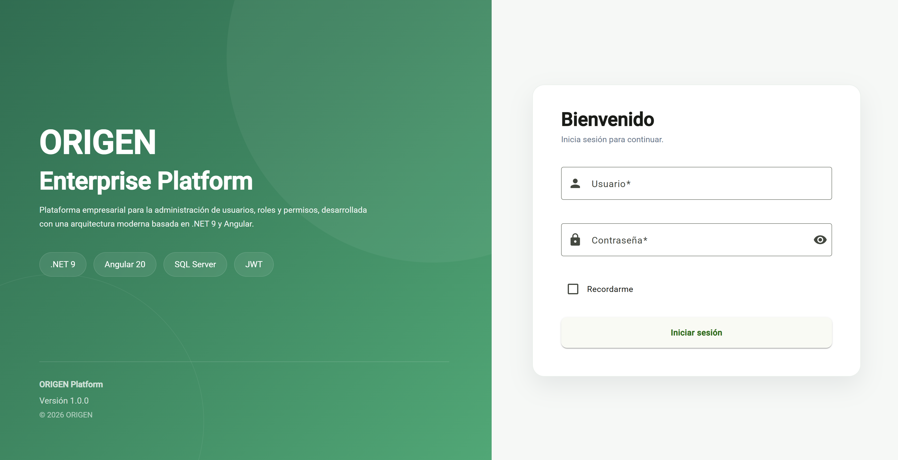
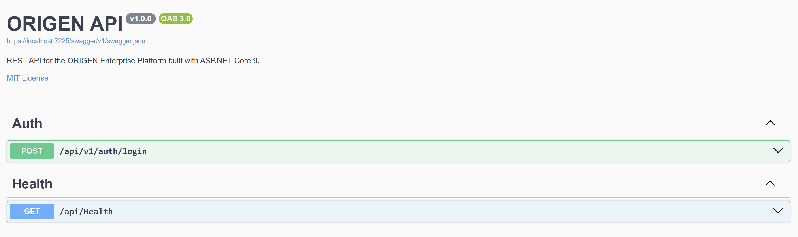
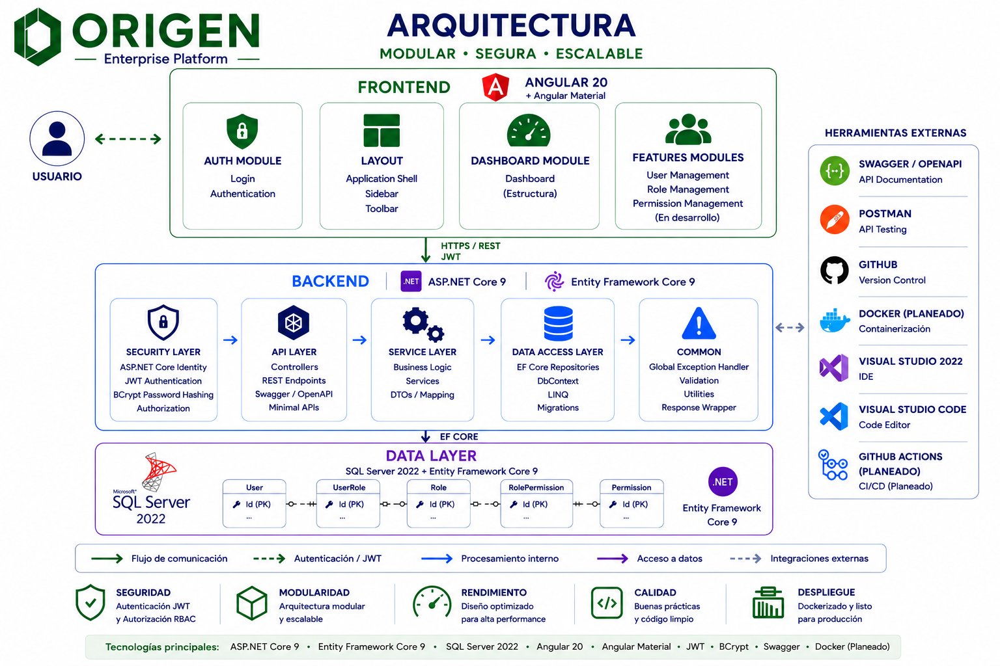

<p align="center">
    
</p>

<h1 align="center">ORIGEN</h1>

<p align="center">
<b>Enterprise Full Stack Platform built with ASP.NET Core and Angular</b>
</p>

<p align="center">

.NET 9 • ASP.NET Core • Angular 20 • SQL Server • JWT • Entity Framework Core

</p>

---

# Overview

ORIGEN is a modern enterprise Full Stack platform developed to demonstrate production-ready software architecture using **.NET 9**, **ASP.NET Core**, **Angular 20**, **Entity Framework Core**, **SQL Server**, and **JWT Authentication**.

The project focuses on clean architecture, modularity, maintainability, secure authentication, and enterprise software development best practices.

---

# Current Version

**v1.0.0 – Initial ASP.NET Core Release**

---

# Technology Stack

| Layer | Technologies |
|--------|--------------|
| Backend | .NET 9, ASP.NET Core |
| Frontend | Angular 20, Angular Material |
| Security | JWT Authentication, BCrypt |
| Persistence | Entity Framework Core |
| Database | SQL Server 2022 |
| Documentation | OpenAPI / Swagger |
| Build | .NET CLI |

---

# Key Features

- Enterprise Full Stack Architecture
- Modular Monolith
- ASP.NET Core 9
- Angular 20
- Angular Material
- Entity Framework Core
- SQL Server
- JWT Authentication
- Role-Based Access Control (RBAC)
- Swagger / OpenAPI
- Clean Architecture
- SOLID Principles

---

# Project Status

| Component | Status |
|-----------|--------|
| Backend | ✅ Stable |
| Authentication | ✅ Completed |
| Authorization (RBAC) | ✅ Completed |
| Angular Integration | ✅ Completed |
| Login Module | ✅ Completed |
| Dashboard Structure | 🚧 In Progress |
| User Management | 📋 Planned |
| Role Management | 📋 Planned |
| Permission Management | 📋 Planned |
| Docker Support | 📋 Planned |
| CI/CD | 📋 Planned |

---

# Application

## Login

<p align="center">
    
</p>

Modern authentication interface built with Angular 20 and Angular Material.

---

## Swagger

<p align="center">
    
</p>

Interactive REST API documentation generated using OpenAPI.

---

# Architecture

<p align="center">
    
</p>

ORIGEN follows a modular architecture where each feature owns its controllers, services, repositories, DTOs and entities, promoting maintainability, scalability and separation of concerns.

---

# Current Features

## Backend

- ASP.NET Core 9
- REST API
- Entity Framework Core
- Dependency Injection
- Configuration using Options Pattern

## Security

- JWT Authentication
- BCrypt Password Encryption
- Role-Based Access Control (RBAC)

## Database

- SQL Server 2022
- Entity Framework Core Migrations

## Frontend

- Angular 20
- Angular Material
- Login Module
- Route Guards
- JWT Interceptor
- Initial Dashboard Structure

---

# Getting Started

## 1. Clone the repository

```bash
git clone https://github.com/esteban-navarro/origen-dotnet.git

cd origen-dotnet
```

---

## 2. Configure the Backend

Copy

```text
backend/src/Origen.Api/appsettings.Development.example.json
```

to

```text
backend/src/Origen.Api/appsettings.Development.json
```

Configure:

- SQL Server connection
- JWT Secret
- JWT Issuer
- JWT Audience

---

## 3. Run the Backend

```bash
cd backend/src/Origen.Api

dotnet restore

dotnet build

dotnet ef database update

dotnet run
```

Backend

```
https://localhost:7225
```

---

## 4. Run the Frontend

```bash
cd frontend

npm install

ng serve
```

Frontend

```
http://localhost:4200
```

---

## Default Credentials

| Username | Password |
|----------|----------|
| admin | Admin123* |

---

## API Documentation

Swagger UI

```
https://localhost:7225/swagger
```

---

# Repository Structure

```text
ORIGEN
│
├── backend
│   └── src
│       └── Origen.Api
│
├── frontend
│
├── docs
│   └── images
│
├── README.md
│
└── LICENSE
```

---

# Roadmap

## Completed

- ASP.NET Core Foundation
- Entity Framework Core
- SQL Server Integration
- JWT Authentication
- RBAC Authorization
- Swagger Documentation
- Angular Integration
- Login Module

---

## In Progress

- Dashboard Module
- Frontend Navigation

---

## Planned

- User Management
- Role Management
- Permission Management
- Refresh Token
- Docker Support
- Docker Compose
- Unit Testing
- Integration Testing
- GitHub Actions
- CI/CD Pipeline

---

# Development Practices

- Clean Architecture
- SOLID Principles
- Modular Monolith
- REST API Design
- Conventional Commits
- Git Flow
- Clean Code

---

# License

This project is licensed under the MIT License.